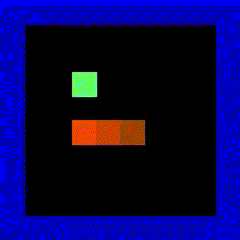

# rl_playground

Basic package for testing and developing Reinforcement Learning algorithms variations (Policy Gradients, Q-Learning etc.)
Tested on a custom snake game.

<h5 align="center">Learning to play snake</h5>